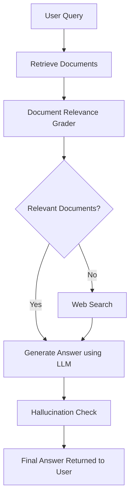

# RAG Assistant – Retrieval Augmented Generation System

## Overview

The **RAG Assistant** is an intelligent question-answering system that retrieves relevant information from a knowledge base and generates accurate responses using Large Language Models (LLMs).

Unlike traditional chatbots that rely only on pre-trained knowledge, this system combines **document retrieval** with **language generation** to produce **context-aware and fact-grounded answers**.

The assistant is designed to answer user queries based on **custom documents or knowledge bases**, making it useful for:

- Institutional assistants
- Document search systems
- Knowledge base Q&A
- Enterprise document assistants

---
## Core Technologies

The system is built using a modern **Retrieval-Augmented Generation (RAG)** architecture.

### Large Language Model
- **Model:** `llama-3.3-70b-versatile`
- Used for **reasoning and answer generation** based on retrieved document context.

### Embedding Model
- **Model:** `BAAI/bge-base-en-v1.5`
- Converts documents and queries into **vector representations** for semantic search.

### Vector Database
- **Database:** **ChromaDB**
- Stores document embeddings and enables **efficient vector similarity retrieval**.

### Retrieval Strategy
The system uses **Hybrid Retrieval**, which combines:

- **Vector Similarity Search** (semantic understanding)
- **BM25 Keyword Search** (exact keyword matching)

This hybrid approach improves retrieval performance by capturing both **semantic meaning** and **exact keyword matches**.

### Reranking
After retrieval, the candidate documents are **reranked** using a **reranking model** to ensure the most relevant documents are placed at the top before being passed to the LLM.

Reranking helps improve:

- Context quality
- Retrieval precision
- Final answer accuracy

---

## Features

- Retrieval-Augmented Generation (RAG)
- Document relevance grading
- Hallucination detection
- Web search fallback when internal knowledge is insufficient
- Modular pipeline using LangGraph
- FastAPI backend for scalable deployment

---

## System Architecture

The system follows a **Retrieval-Augmented Generation pipeline** where documents are retrieved first and then used by an LLM to generate answers.

### RAG Pipeline Diagram

## Workflow

1. User submits a query.
2. System retrieves relevant documents from the knowledge base.
3. Retrieved documents are graded for relevance.
4. If documents are sufficient, the system generates an answer.
5. If documents are insufficient, the system performs web search.
6. LLM generates the final response using retrieved context.
7. Generated answer is checked for hallucinations.

---

## Project Structure

